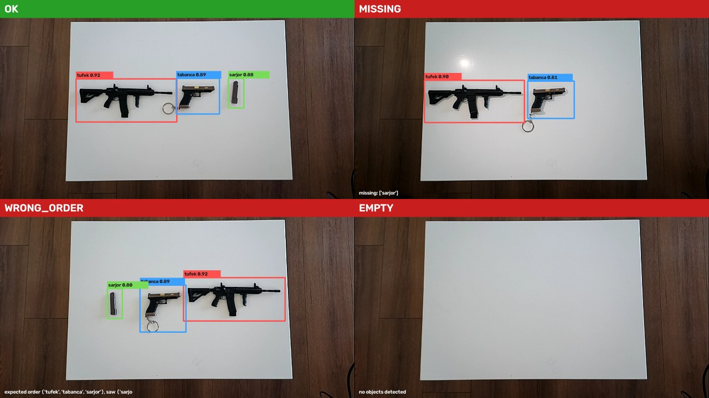

# Inventory / State Verification System (Edge AI)

A fixed camera watches a defined work area, detects a small set of objects, and
verifies the **state** of the scene against an expected configuration:

- **missing part** — an expected object is not present
- **wrong order** — objects present but in the wrong left-to-right sequence
- **wrong combination** — an unexpected / duplicate object

Output per confirmed frame window: `OK` or a typed error.

> Internship project at Heysem AI. All objects in the demo are **toy / replica
> models** (~10–15 cm plastic) — no real firearms are involved.

## Demo

▶️ **https://www.youtube.com/watch?v=sU56IWzHs5M**



<sub>Detector output + verdict, one frame per scenario. Boxes are the fine-tuned
YOLO11s; the banner is the state layer's decision.</sub>

## Architecture

Two layers:

| Layer | Responsibility | Tech |
|-------|----------------|------|
| **Detection** | Per-frame object detection (+ a second same-class overlap pass on top of NMS) | YOLO11s, transfer-learning fine-tune (Ultralytics) |
| **State logic** | Temporal smoothing (N-frame consistency) → finite state machine → compare vs expected layout → `OK` / typed error | Plain Python |

```
OAK-D frame
  → YOLO11s detector          (tufek / tabanca / sarjor + boxes)
  → SceneReading              (left→right class sequence, same-class dedup)
  → TemporalSmoother          (reading must hold N of last W frames)
  → Verifier                  (vs expected [tufek, tabanca, sarjor])
  → StateMachine              (emits only confirmed OK↔ERROR transitions)
  → overlay + log
```

## Results

**Detection** — held-out test set (45 images, never seen in training):

| class | AP@50 | precision | recall |
|-------|------:|----------:|-------:|
| tabanca | 0.99 | 0.99 | 1.00 |
| sarjor  | 0.92 | 0.92 | 0.88 |
| tufek   | 0.90 | 0.93 | 0.63¹ |
| **all** | **0.94** | 0.95 | 0.84 |

¹ recall is measured at the F1-optimal threshold; at the pipeline's operating
confidence (0.30) the rifle is found in 38/38 test frames.

**Inference:** 3.5 ms/frame on an RTX 4070 Laptop GPU (~285 FPS raw model).

**System level** (`scripts/eval_system.py`, detector + verifier on the raw
captures): **OK-vs-error 97.8%**, exact verdict type 85.9%. The gap is the
open-set case — a foreign object not in the class set is flagged as an anomaly
but not classified as `wrong_combination` specifically.

## Dataset

452 images captured with the OAK-D (`scripts/capture.py`), labelled in
**[Label Studio](https://github.com/HumanSignal/label-studio)** with a bootstrap
loop: ~50 frames by hand → train a small model → `scripts/ls_prelabel.py`
pre-annotates the rest in Label Studio → review the pre-filled boxes. Split per
scenario in capture-timestamp order so continuous-capture bursts don't leak
between train and test. Full workflow: [docs/labeling.md](docs/labeling.md).

Dataset + trained weights: **[dataset-v1 release][rel]**. Details:
[docs/dataset.md](docs/dataset.md).

[rel]: https://github.com/yagizakkaya01/inventory-verification/releases/tag/dataset-v1

## Run it

```powershell
# setup (once)
.\scripts\setup_env.ps1
pip install torch torchvision --index-url https://download.pytorch.org/whl/cu128
pip install -r requirements.txt

# download dataset-v1, unpack into data/datasets/inventory/, put the weights at
# models/checkpoints/inventory-yolo11s/weights/best.pt

# train (optional — weights are in the release)
python -m src.detection.train --config configs\train.yaml

# live, from an OAK-D
python -m src.pipeline.run --config configs\pipeline.yaml

# offline check on the captured images
python -m scripts.eval_system --split test
```

`configs/pipeline.yaml` sets the source, model, smoothing window and the
expected layout.

## Repository layout

```
configs/     dataset / training / runtime YAML
src/
  detection/ YOLO wrapper + training entrypoint
  state/     temporal smoothing · verifier · state machine
  pipeline/  real-time loop + camera sources (webcam / OAK-D)
  edge/      ONNX / TensorRT / OAK-D blob export
  utils/     typed config
scripts/     capture, Label Studio bootstrap loop, dataset build, system eval
benchmarks/  FPS / latency harness
tests/       state-logic unit tests
docs/        plan · setup · scenarios · metrics · dataset
```

## Status / next

- [x] Data collection, labelling, detector (test mAP@50 0.94)
- [x] Temporal smoothing + state machine + verifier, real-time loop
- [ ] Edge deployment — TensorRT INT8, OAK-D `.blob` — and post-quantization
      accuracy / FPS comparison
- [ ] Open-set handling for unexpected objects

Timeline and design notes: [docs/plan.md](docs/plan.md),
[docs/scenarios.md](docs/scenarios.md), [docs/metrics.md](docs/metrics.md).

## Built with

- [Ultralytics YOLO11](https://github.com/ultralytics/ultralytics) — detector
- [Label Studio](https://github.com/HumanSignal/label-studio) (HumanSignal) —
  annotation; the bootstrap loop in [docs/labeling.md](docs/labeling.md) drives
  it from `scripts/`
- [DepthAI](https://github.com/luxonis/depthai) (Luxonis) — OAK-D camera
- OpenCV · PyTorch
